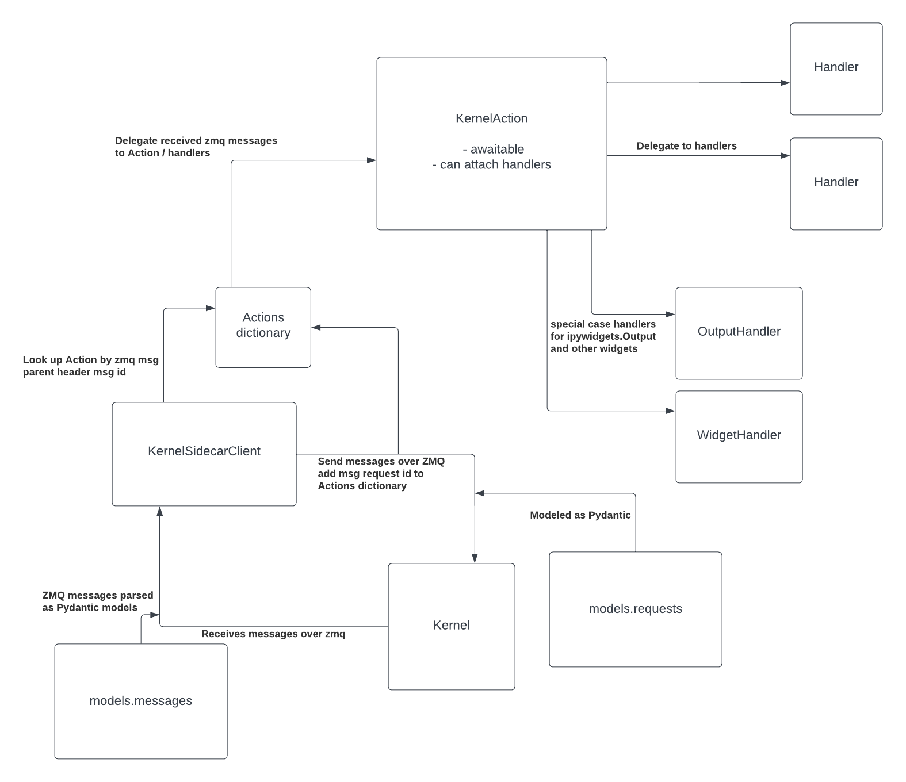

<p align="center">
Kernel Sidecar
</p>

<p align="center">

<a href="https://github.com/kafonek/kernel-sidecar/actions/workflows/tests.yaml">
    
</a>

</p>

# Overview

`kernel-sidecar` provides the building blocks for creating applications that run alongside Jupyter Kernels, keeping the Notebook document model in memory and acting as a middle-man between the Kernel and all other clients. There are many potential features that can be built into a Sidecar application:

 - __Persisting Outputs__ for cell execution even when no clients are connected (e.g. run a cell, close your browser, come back later and see the output)
 - __Code Cell Linting__ such as `black` or `isort`
 - __Variable Explorer__ that can be sent to newly connected clients without needing to execute code in the Kernel
 - __Custom Execution Managers__ to handle DAG/dependent cell execution or to dequeue queued cells without sending an interrupt to the Kernel which dequeues all queued cells


## Installation

```bash
pip install kernel-sidecar
```


# Key Concepts



## KernelSidecarClient

The `KernelSidecarClient` class manages the ZMQ connections to the Kernel, sending execute request or other messages to the Kernel, and processing messages coming back from the Kernel on `iopub`, `shell`, `control`, and `stdin` channels. All messages sent and received are modeled with Pydantic. When preparing to send a request to the Kernel, it's structured as a `KernelAction` which connects the request with zero-to-many callbacks for responses to that specific request.


## KernelAction

`KernelAction` connects three key pieces of the request-reply flow between the sidecar application and the Kernel:
 - Store the sent Request message
 - Delegate messages to callbacks based on the request message
 - Make the flow "awaitable" based on the Request type, e.g. an `execute_request` is done when `execute_reply` or `error` is received and `status` has gone to `idle`.

## Handlers

When the `KernelSidecarClient` receives a message over ZMQ, parses it into a Pydantic model, and delegates it to the appropriate `Action` to be handled, it passes on that message to every `Handler` attached to the `Action` and awaits all of them to handle that message. `Handler` objects can define handling different message types by creating methods named for the message type, e.g. `async def handle_display_data`. See `handlers.DebugHandler` or `cli.OutputHandler` for examples of custom Handlers.

## Comms

Comms are a flexible way for a client and the Kernel to send messages outside of the `execute_request` format. The most widely used package that utilizes Comms is probably `ipywidgets`, but Comms in general are a very powerful tool for a Sidecar application. A Comm can be opened by either the Sidecar or the Kernel. A target for that Comm should be registered on the other side before the open happens. It's probably most typical to register a Comm target in the Kernel by sending an `execute_request`, then sending a `comm_open` from the Sidecar side. See `tests/test_comms.py` for examples.

Once a Comm is open, it has a unique `comm_id`. `KernelSidecarClient` will automatically route all `comm_msg` messages to a `CommHandler` instance by `comm_id` in the `comm_msg` content. That routing pattern is a bit confusing as it overlaps the `Handler` / `Action` pattern, but it's necessary because `comm_msg` can come in as a result of `execute_request`'s or `comm_msg`'s or potentially other messages. So the `CommManager` -> `CommHandler` routing basically needs to be applied to every message the `KernelSidecarClient` receives over ZMQ.


## Models

`kernel-sidecar` has Pydantic models for:
 - The Jupyter Notebook document (`models/notebook.py`), which should be consistent with `nbformat` parsing / structure
 - Request messages sent to the Kernel over ZMQ (`models/requests.py`)
 - Messages received over ZMQ from the Kernel (`models/messages.py`)


## CLI

`kernel-sidecar` ships a small CLI for testing a connection to a Kernel.

```bash
❯ sidecar --help
Usage: sidecar [OPTIONS]

Options:
  -f FILE                         Kernel connection file  [required]
  --debug / --no-debug            Turn on DEBUG logging  [default: no-debug]
  --execute TEXT                  Execute code string instead of sending
                                  kernel info request
  --tail / --no-tail              Continue tailing ZMQ after connecting or
                                  executing code  [default: no-tail]
  --install-completion [bash|zsh|fish|powershell|pwsh]
                                  Install completion for the specified shell.
  --show-completion [bash|zsh|fish|powershell|pwsh]
                                  Show completion for the specified shell, to
                                  copy it or customize the installation.
  --help                          Show this message and exit.
```

Try it out by starting an IPython kernel in one terminal and using the CLI in another.

```bash
python -m ipykernel_launcher --debug -f /tmp/kernel.json
```

```bash
kernel-sidecar on  release-0.3.2 [$?] is 📦 v0.3.1 via 🐍 v3.11.0 (kernel-sidecar-py3.11) 
❯ sidecar -f /tmp/kernel.json
2023-03-10T14:31:59.992235Z [info     ] Attempting to connect:
{'control_port': 34897,
 'hb_port': 49821,
 'iopub_port': 40577,
 'ip': '127.0.0.1',
 'kernel_name': '',
 'key': '615bcebc-baf2e28abad1f6c017dc71dc',
 'shell_port': 37421,
 'signature_scheme': 'hmac-sha256',
 'stdin_port': 41405,
 'transport': 'tcp'} [kernel_sidecar.cli] filename=cli.py func_name=main lineno=62
2023-03-10T14:32:00.026503Z [info     ] {'banner': 'Python 3.11.0 (main, Nov  7 2022, 09:38:45) [GCC 9.4.0]\n'
           "Type 'copyright', 'credits' or 'license' for more information\n"
           "IPython 8.10.0 -- An enhanced Interactive Python. Type '?' for "
           'help.\n',
 'debugger': None,
 'help_links': [{'text': 'Python Reference',
                 'url': 'https://docs.python.org/3.11'},
                {'text': 'IPython Reference',
                 'url': 'https://ipython.org/documentation.html'},
                {'text': 'NumPy Reference',
                 'url': 'https://docs.scipy.org/doc/numpy/reference/'},
                {'text': 'SciPy Reference',
                 'url': 'https://docs.scipy.org/doc/scipy/reference/'},
                {'text': 'Matplotlib Reference',
                 'url': 'https://matplotlib.org/contents.html'},
                {'text': 'SymPy Reference',
                 'url': 'http://docs.sympy.org/latest/index.html'},
                {'text': 'pandas Reference',
                 'url': 'https://pandas.pydata.org/pandas-docs/stable/'}],
 'implementation': 'ipython',
 'implementation_version': '8.10.0',
 'language_info': {'codemirror_mode': {'name': 'ipython', 'version': 3},
                   'file_extension': '.py',
                   'mimetype': 'text/x-python',
                   'name': 'python',
                   'nbconvert_exporter': 'python',
                   'pygments_lexer': 'ipython3',
                   'version': '3.11.0'},
 'protocol_version': '5.3',
 'status': 'ok'} [kernel_sidecar.cli] filename=cli.py func_name=connect lineno=44
```

```bash
❯ sidecar -f /tmp/kernel.json --execute "print('Hello, World'); 1/0"
2023-03-10T14:33:27.394935Z [info     ] Attempting to connect:
{'control_port': 34897,
 'hb_port': 49821,
 'iopub_port': 40577,
 'ip': '127.0.0.1',
 'kernel_name': '',
 'key': '615bcebc-baf2e28abad1f6c017dc71dc',
 'shell_port': 37421,
 'signature_scheme': 'hmac-sha256',
 'stdin_port': 41405,
 'transport': 'tcp'} [kernel_sidecar.cli] filename=cli.py func_name=main lineno=62
2023-03-10T14:33:27.629630Z [info     ] Hello, World
                  [kernel_sidecar.cli] filename=cli.py func_name=handle_stream lineno=23
2023-03-10T14:33:27.702700Z [error    ] division by zero               [kernel_sidecar.cli] filename=cli.py func_name=handle_error lineno=31
```
